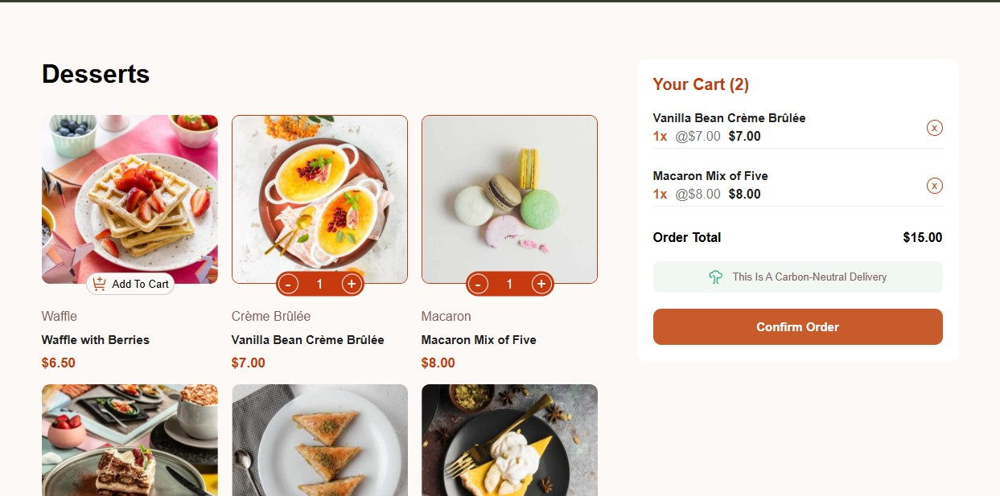

# Frontend Mentor – Product List with Cart

This is my solution to the **Product List with Cart** challenge from Frontend Mentor.  
The goal was to build a responsive product list with full cart functionality and order confirmation flow.

## Overview

### The Challenge

Users can:

- Add and remove products from the cart  
- Increase or decrease item quantities  
- View the total price and item count  
- Confirm the order via a modal  
- Start a new order (reset cart)  
- Experience responsive layouts and hover states  

### Screenshot

### Links

- **Solution:** https://www.frontendmentor.io/solutions/interactive-cart-vanilla-js-state-management-and-localstorage-4f8_xoW7U5
- **Live Site:** https://ammar-antar.github.io/Product-List-With-Cart/

## My Process

### Built With

- Semantic HTML5  
- CSS (Flexbox & Grid)  
- Vanilla JavaScript  
- LocalStorage for cart persistence  
- Mobile-first workflow  

### What I Learned

- Managing UI state using JavaScript without a framework  
- Syncing DOM state with `localStorage`  
- Handling dynamic UI updates (cart, modal, totals)  
- Structuring code for readability and scalability  

### Continued Development

- Improve performance by reducing re-renders  
- Refactor cart logic into reusable functions  
- Add accessibility enhancements (ARIA, keyboard support)

## Author

- **Name:** Ammar Antar  
- **Frontend Mentor:** https://www.frontendmentor.io/profile/ammar-antar  
- **Email:** ammar.antarh@gmail.com  
